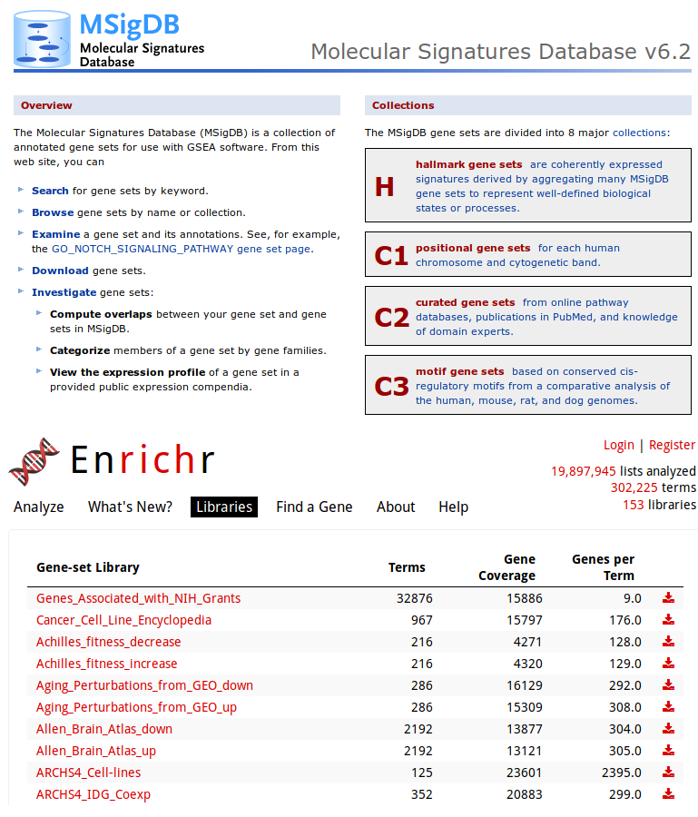
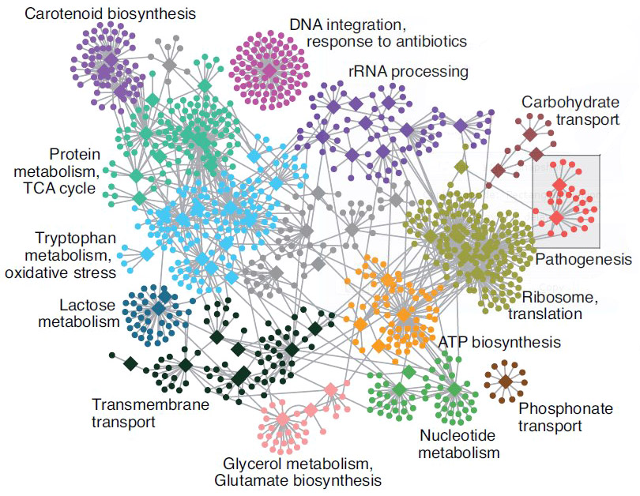
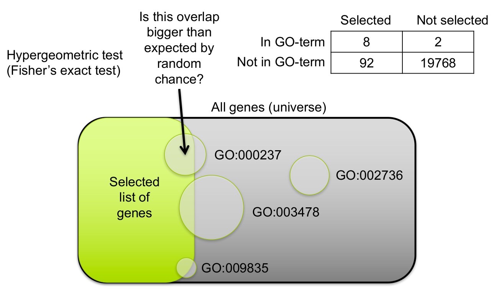
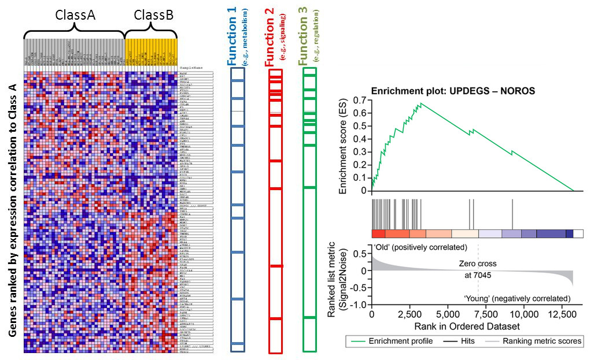

exclude: true
count: false

```{r,echo=FALSE,child="assets/header-presentation.Rmd"}
```

<!-- ------------ Only edit title, subtitle & author above this ------------ -->

```{r,include=FALSE}
# load the packages you need
library(dplyr)
library(tidyr)
#library(stringr)
library(ggplot2)
#library(plotly)
library(pheatmap)
library(DESeq2)
library(edgeR)
```

---
name: content
class: spaced

## Contents

* [Preprocessing](#pp)
* [Normalisation](#norm-1)
* [Exploratory](#eda-cor)
* [DGE](#dge)

---
name: raw

## Raw data

- Raw count table

```{r,eval=TRUE,echo=FALSE}
cr <- read.table("./data/count_raw.txt",header=TRUE)
cr[1:6,1:6]
```

- Metadata

```{r,eval=TRUE,echo=FALSE}
mr <- read.csv2("./data/metadata_raw.csv",header=TRUE,stringsAsFactors=F)
rownames(mr) <- mr$Sample_ID
mr[1:6,]
```

---
name: pp

## Preprocessing

- Remove genes and samples with low counts

```{r,echo=TRUE}
cf1 <- cr[rowSums(cr>0) >= 2, ]
cf2 <- cr[rowSums(cr>5) >= 2, ]
cf3 <- cr[rowSums(edgeR::cpm(cr)>1) >= 2, ]
```

--

- Inspect distribution

```{r,fig.height=2.7,fig.width=9,echo=FALSE}
h0 <- cr %>% 
  mutate(gene=rownames(.)) %>% 
  gather(key="sample",value="value",-gene) %>%
  ggplot(aes(x=log10(value+1),group=sample))+
  geom_density()+
  labs(x=expression('Log'[10]~'Read counts'),y="Density",title="Raw")+
  theme_bw()+
  theme(panel.border=element_blank(),
        axis.ticks=element_blank())

h1 <- cf1 %>% 
  mutate(gene=rownames(.)) %>% 
  gather(key="sample",value="value",-gene) %>%
  ggplot(aes(x=log10(value+1),group=sample))+
  geom_density()+
  labs(x=expression('Log'[10]~'Read counts'),y="Density",title="Method 1")+
  theme_bw()+
  theme(panel.border=element_blank(),
        axis.ticks=element_blank())

h2 <- cf2 %>% 
  mutate(gene=rownames(.)) %>% 
  gather(key="sample",value="value",-gene) %>%
  ggplot(aes(x=log10(value+1),group=sample))+
  geom_density()+
  labs(x=expression('Log'[10]~'Read counts'),y="Density",title="Method 2")+
  theme_bw()+
  theme(panel.border=element_blank(),
        axis.ticks=element_blank())

h3 <- cf3 %>% 
  mutate(gene=rownames(.)) %>% 
  gather(key="sample",value="value",-gene) %>%
  ggplot(aes(x=log10(value+1),group=sample))+
  geom_density()+
  labs(x=expression('Log'[10]~'Read counts'),y="Density",title="Method 3")+
  theme_bw()+
  theme(panel.border=element_blank(),
        axis.ticks=element_blank())

ggpubr::ggarrange(h0,h1,h2,h3,nrow=1,ncol=4)
```

--

- Inspect the number of rows

```{r,eval=TRUE,echo=FALSE}
cat(paste0("Raw: ",nrow(cr),", Method 1: ",nrow(cf1),", Method 2: ",nrow(cf2),", Method 3: ",nrow(cf3)))
cf <- cf3
rm(cf1,cf2,cf3)
```

---
name: norm-1

## Normalisation

.pull-left-50[
- Make counts comparable across samples
- Control for sequencing depth


```{r,echo=FALSE}
dfr <- data.frame(s1=c(20,25,15),s2=c(6,6,4))
rownames(dfr) <- c("x","y","z")
dfr$s1_tc <- round(dfr$s1/sum(dfr$s1),2)
dfr$s2_tc <- round(dfr$s2/sum(dfr$s2),2)
dfr
```
]

--

.pull-right-50[
- Control for sequencing bias


```{r,echo=FALSE}
dfr <- data.frame(s1=c(20,25,15,100),s2=c(20,25,4,2))
rownames(dfr) <- c("x","y","z","de")
dfr$s1_tc <- round(dfr$s1/sum(dfr$s1),2)
dfr$s2_tc <- round(dfr$s2/sum(dfr$s2),2)
dfr
#dfr$s3_tc <- round(dfr$s3/sum(dfr$s3),2)
#sf <- apply(dfr[,1:3]/(apply(dfr[,1:3],1,mean)),2,median)
#cb <- round(t(t(dfr[,1:3])/sf),2); colnames(cb) <- c("s1_c","s2_c","s3_c")
#cbind(dfr,cb)
```
]

---
name: norm-2

## Normalisation

- Make counts comparable across features (genes)
.size-60[]

```{r,echo=FALSE}
dfr <- data.frame(counts=c(50,25),gene_length=c(10,5))
dfr$norm_counts <- round(dfr$counts/dfr$gene_length,2)
dfr
```

--

- Bring counts to a human-friendly scale

---
name: norm-3

## Normalisation

- CPM, RPKM, FPKM, TPM, RLE, MRN, Q, UQ, TMM, VST, RLOG, VOOM ... Too many...

--

- **CPM**: Controls for sequencing depth when dividing by total count. Not for within-sample comparison or DE.

--

- **RPKM/FPKM**: Controls for sequencing depth and gene length. Good for technical replicates, not good for sample-sample due to compositional bias. Assumes total RNA output is same in all samples. Not for DE.

--

- **TPM**: Similar to RPKM/FPKM. Corrects for sequencing depth and gene length. Also comparable between samples but no correction for compositional bias.

--

- **TMM/RLE/MRN**: Improved assumption: The output between samples for a core set only of genes is similar. Corrects for compositional bias. Used for DE. RLE and MRN are very similar and correlates well with sequencing depth. `edgeR::calcNormFactors()` implements TMM, TMMwzp, RLE & UQ. `DESeq2::estimateSizeFactors` implements median ratio method (RLE). Does not correct for gene length.

--

- **VST/RLOG/VOOM**: Variance is stabilised across the range of mean values. For use in exploratory analyses. Not for DE. `vst()` and `rlog()` functions from *DESeq2*. `voom()` function from *Limma* converts data to normal distribution.

--

- **[geTMM](https://bmcbioinformatics.biomedcentral.com/articles/10.1186/s12859-018-2246-7)**: Gene length corrected TMM.

.citation[
.cite[<i class="fas fa-link"></i> Dillies, Marie-Agnes, *et al*. "A comprehensive evaluation of normalization methods for Illumina high-throughput RNA sequencing data analysis." [Briefings in bioinformatics 14.6 (2013): 671-683](https://www.ncbi.nlm.nih.gov/pubmed/22988256)]  
.cite[<i class="fas fa-link"></i> Evans, Ciaran, Johanna Hardin, and Daniel M. Stoebel. "Selecting between-sample RNA-Seq normalization methods from the perspective of their assumptions." [Briefings in bioinformatics (2017)](https://arxiv.org/abs/1609.00959)]  
]

---
name: norm-4

## Normalisation

**Recommendations**

- For DGE using DGE R packages (DESeq2, edgeR, Limma etc), use raw counts
- For visualisation (PCA, clustering, heatmaps etc), use VST or RLOG
- For own analysis with gene length correction, use TPM (maybe geTMM?)
- Other solutions: spike-ins/house-keeping genes

--

```{r,include=FALSE}
tpm <- function(counts,len) {
  x <- counts/len
  return(t(t(x)*1e6/colSums(x)))
}

#tpm
g <- read.delim("./data/human_genes.txt",header=T,stringsAsFactors=F)
g <- g[!duplicated(g$ensembl_gene_id),]
g$len <- g$end_position-g$start_position
rownames(g) <- g$ensembl_gene_id
igenes <- intersect(rownames(cf),g$ensembl_gene_id)
g1 <- g[igenes,]
cf1 <- cf[igenes,]
ct <- tpm(cf1,g1$len)

# deseq2
mr$Time <- factor(mr$Time)
d <- DESeqDataSetFromMatrix(countData=cf,colData=mr,design=~Time)
d <- DESeq2::estimateSizeFactors(d,type="ratio")
cd <- counts(d,normalized=TRUE)

# vst
mr$Time <- factor(mr$Time)
d <- DESeqDataSetFromMatrix(countData=cf,colData=mr,design=~Time)
d <- DESeq2::estimateSizeFactors(d,type="ratio")
d <- DESeq2::estimateDispersions(d)
cv <- as.data.frame(assay(varianceStabilizingTransformation(d,blind=T)),check.names=F)
```

```{r,fig.height=1.8,fig.width=8,echo=FALSE}
h0 <- cf %>% 
  mutate(gene=rownames(.)) %>% 
  gather(key="sample",value="value",-gene) %>%
  ggplot(aes(x=log10(value+1),group=sample))+
  geom_density()+
  labs(x=expression('Log'[10]~'Read counts'),y="Density",title="Raw")+
  theme_bw()+
  theme(panel.border=element_blank(),
        axis.ticks=element_blank())

h1 <- as.data.frame(edgeR::cpm(cf)) %>% 
  mutate(gene=rownames(.)) %>% 
  gather(key="sample",value="value",-gene) %>%
  ggplot(aes(x=log10(value+1),group=sample))+
  geom_density()+
  labs(x=expression('Log'[10]~'Read counts'),y="Density",title="CPM")+
  theme_bw()+
  theme(panel.border=element_blank(),
        axis.ticks=element_blank())

h2 <- as.data.frame(ct) %>% 
  mutate(gene=rownames(.)) %>% 
  gather(key="sample",value="value",-gene) %>%
  ggplot(aes(x=log10(value+1),group=sample))+
  geom_density()+
  labs(x=expression('Log'[10]~'Read counts'),y="Density",title="TPM")+
  theme_bw()+
  theme(panel.border=element_blank(),
        axis.ticks=element_blank())

h3 <- as.data.frame(cd) %>% 
  mutate(gene=rownames(.)) %>% 
  gather(key="sample",value="value",-gene) %>%
  ggplot(aes(x=log10(value+1),group=sample))+
  geom_density()+
  labs(x=expression('Log'[10]~'Read counts'),y="Density",title="DESeq2")+
  theme_bw()+
  theme(panel.border=element_blank(),
        axis.ticks=element_blank())

h4 <- cv %>% 
  mutate(gene=rownames(.)) %>% 
  gather(key="sample",value="value",-gene) %>%
  ggplot(aes(x=value,group=sample))+
  geom_density()+
  labs(x='Read counts',y="Density",title="VST")+
  theme_bw()+
  theme(panel.border=element_blank(),
        axis.ticks=element_blank())

ggpubr::ggarrange(h0,h1,h2,h3,h4,nrow=1,ncol=5)
```

```{r,fig.height=1.8,fig.width=8,echo=FALSE}
h0 <- cf %>% 
    mutate(gene=rownames(.)) %>% 
    gather(key="sample",value="value",-gene) %>%
    group_by(gene) %>% summarise(mean=mean(value),var=var(value)) %>%
    ggplot(aes(x=log10(mean+1),y=log10(var+1)))+
    geom_point(alpha=0.3)+
    labs(x=expression('Log'[10]~'mean'),y=expression('Log'[10]~'variance'),title="Raw")+
    theme_bw()+
    theme(panel.border=element_blank(),
          axis.ticks=element_blank())

h1 <- as.data.frame(edgeR::cpm(cf)) %>% 
    mutate(gene=rownames(.)) %>% 
    gather(key="sample",value="value",-gene) %>%
    group_by(gene) %>% summarise(mean=mean(value),var=var(value)) %>%
    ggplot(aes(x=log10(mean+1),y=log10(var+1)))+
    geom_point(alpha=0.3)+
    labs(x=expression('Log'[10]~'mean'),y=expression('Log'[10]~'variance'),title="CPM")+
    theme_bw()+
    theme(panel.border=element_blank(),
          axis.ticks=element_blank())

h2 <- as.data.frame(ct) %>% 
    mutate(gene=rownames(.)) %>% 
    gather(key="sample",value="value",-gene) %>%
    group_by(gene) %>% summarise(mean=mean(value),var=var(value)) %>%
    ggplot(aes(x=log10(mean+1),y=log10(var+1)))+
    geom_point(alpha=0.3)+
    labs(x=expression('Log'[10]~'mean'),y=expression('Log'[10]~'variance'),title="TPM")+
    theme_bw()+
    theme(panel.border=element_blank(),
          axis.ticks=element_blank())

h3 <- as.data.frame(cd) %>% 
    mutate(gene=rownames(.)) %>% 
    gather(key="sample",value="value",-gene)%>%
    group_by(gene) %>% summarise(mean=mean(value),var=var(value)) %>%
    ggplot(aes(x=log10(mean+1),y=log10(var+1)))+
    geom_point(alpha=0.3)+
    labs(x=expression('Log'[10]~'mean'),y=expression('Log'[10]~'variance'),title="DESeq2")+
    theme_bw()+
    theme(panel.border=element_blank(),
          axis.ticks=element_blank())

h4 <- cv %>% 
    mutate(gene=rownames(.)) %>% 
    gather(key="sample",value="value",-gene) %>%
    group_by(gene) %>% summarise(mean=mean(value),var=var(value)) %>%
    ggplot(aes(x=mean,y=var))+
    geom_point(alpha=0.3)+
    labs(x='Mean',y='Variance',title="VST")+
    theme_bw()+
    theme(panel.border=element_blank(),
          axis.ticks=element_blank())

ggpubr::ggarrange(h0,h1,h2,h3,h4,nrow=1,ncol=5)
```

---
name: eda-cor

## Exploratory | Correlation

* Correlation between samples

```{r,ech=FALSE,fig.height=4.5,fig.width=5.5}
dmat <- as.matrix(cor(cv,method="spearman"))
pheatmap::pheatmap(dmat,border_color=NA,annotation_col=mr[,"Time",drop=F],
         annotation_row=mr[,"Time",drop=F],annotation_legend=T)
```

---
name: eda-dist

## Exploratory | Distance

* Similarity between samples

```{r,echo=TRUE,fig.height=4.5,fig.width=5.5}
dmat <- as.matrix(dist(t(cv)))
pheatmap(dmat,border_color=NA,annotation_col=mr[,"Time",drop=F],
         annotation_row=mr[,"Time",drop=F],annotation_legend=T)
```

---
name: eda-pca

## Exploratory | PCA

* Relationship between samples

.pull-left-40[
```{r,echo=FALSE,fig.height=3.5,fig.width=3.5}
pcaobj <- prcomp(x=t(cv))
{par(mar=c(4,4,0.5,0))
barplot(round(pcaobj$sdev^2/sum(pcaobj$sdev^2)*100,2),las=2,
        names.arg=colnames(pcaobj$x),ylab="% Variance explained",
        xlab="PCA principal components")}
```
]

.pull-right-60[
```{r,echo=FALSE,fig.height=4,fig.width=4.5}
pcamat1 <- as.data.frame(pcaobj$x)
pcamat2 <- merge(pcamat1,mr,by=0)

ggplot(pcamat2,aes(PC1,PC2,colour=Time))+
  geom_point()+
  theme_bw()+
  theme(panel.border=element_blank(),
        axis.ticks=element_blank())
```

```{r,eval=FALSE,include=FALSE}
# plotly pca
library(plotly)
pcamat2$tt <- paste0("<b>ID: </b>",pcamat2$Sample_ID,"\n",
                   "<b>Name: </b>",pcamat2$Sample_Name)
p1 <- plot_ly(pcamat2,x=~PC1,y=~PC2,z=~PC3,text=~tt,hoverinfo="text")
add_markers(p1,color=~Time)
```

]

---
name: dge

## DGE

* Create the DESeq2 object

```{r}
library(DESeq2)
mr$Time <- factor(mr$Time)
d <- DESeqDataSetFromMatrix(countData=cf,colData=mr,design=~Time)
d
```

* Model must be factors

- `~var`
- `~covar+var`

---
name: dge-sf

## DGE | Size factors

* Normalisation factors are computed

```{r}
d <- DESeq2::estimateSizeFactors(d,type="ratio")
sizeFactors(d)
```

---
name: dge-dispersion

## DGE | Dispersion

* We need a measure variability of gene counts

```{r}
dm <- apply(cd,1,mean)
dv <- apply(cd,1,var)
cva <- function(x) sd(x)/mean(x)
dc <- apply(cd,1,cva)
```

--

```{r,echo=FALSE,fig.height=2.5,fig.width=5}
h1 <- ggplot(data.frame(mean=log10(dm+1),var=log10(dv+1)),
       aes(mean,var))+
  geom_point(alpha=0.2)+
  geom_smooth(method="lm")+
  labs(x=expression('Log'[10]~'Mean counts'),y=expression('Log'[10]~'Variance'))+
  theme_bw()

h2 <- ggplot(data.frame(mean=log10(dm+1),var=dc),
       aes(mean,var))+
  geom_point(alpha=0.2)+
  geom_smooth(method="lm")+
  labs(x=expression('Log'[10]~'Mean counts'),y="Coefficient of variation")+
  theme_bw()
ggpubr::ggarrange(h1,h2,nrow=1,ncol=2)
```

* Dispersion is a measure of variability in gene expression for a given mean

---
name: dge-dispersion-2

## DGE | Dispersion

* D is unreliable for low mean counts
* Genes with similar mean values must have similar dispersion
* Estimate likely (ML) dispersion for each gene based on counts
* Fit a curve through the gene-wise estimates
* Shrink dispersion towards the curve

```{r,fig.height=3,fig.width=3}
d <- DESeq2::estimateDispersions(d)
{par(mar=c(4,4,1,1))
plotDispEsts(d)}
```

---
name: dge-test

## DGE | Test

* Log2 fold changes changes are computed after GLM fitting

```{r}
dg <- nbinomWaldTest(d)
resultsNames(dg)
```

--

* Use `results()` to customise/return results
  * Set coefficients using `contrast` or `name`
  * Filtering by fold change using `lfcThreshold`
  * `cooksCutoff` removes outliers
  * `independentFiltering`
  * `pAdjustMethod`
  * `alpha`

---
name: dge-test-2

## DGE | Test

```{r}
res1 <- results(dg,name="Time_t2_vs_t0",alpha=0.05)
summary(res1)
```

---
name: dge-test-3

## DGE | Test

```{r}
head(res1)
```

--

* Use `lfcShrink()` to correct fold changes for high dispersion genes

<!-- --------------------- Do not edit this and below --------------------- -->

---

# Acknowledgements

* [Normalising RNA-seq data](https://www.ebi.ac.uk/sites/ebi.ac.uk/files/content.ebi.ac.uk/materials/2012/121029_HTS/ernest_turro_normalising_rna-seq_data.pdf) by Ernest Turro  
* RNA-seq analysis [Bioconductor vignette](http://master.bioconductor.org/packages/release/workflows/vignettes/rnaseqGene/inst/doc/rnaseqGene.html)
* [DGE Workshop](https://github.com/hbctraining/DGE_workshop/tree/master/lessons) by HBC training

---
name: end_slide
class: end-slide, middle
count: false

# Thank you. Questions?

```{r,echo=FALSE,child="assets/footer-presentation.Rmd"}
```

```{r,include=FALSE,eval=FALSE}
# manually run this to render this document to HTML
rmarkdown::render("presentation_dge.Rmd")
# manually run this to convert HTML to PDF
#pagedown::chrome_print("presentation_dge.html",output="presentation_dge.pdf")
```

<!--chapter:end:presentation_dge.Rmd-->

---
title: "Exploratory and differential expression analyses"
subtitle: "Workshop on RNA-Seq"
author: "`r paste0('<b>Ashfaq Ali</b> | ',format(Sys.time(), '%d-%b-%Y'))`"
institute: NBIS, SciLifeLab
keywords: bioinformatics, course, scilifelab, nbis
output:
  xaringan::moon_reader:
    encoding: 'UTF-8'
    self_contained: false
    chakra: 'assets/remark-latest.min.js'
    css: 'assets/presentation.css'
    lib_dir: libs
    nature:
      ratio: '4:3'
      highlightLanguage: r
      highlightStyle: github
      highlightLines: true
      countIncrementalSlides: false
      slideNumberFormat: "%current%/%total%"
---
exclude: true
count: false

```{r,echo=FALSE,child="assets/header-presentation.Rmd"}
```

<!-- ------------ Only edit title, subtitle & author above this ------------ -->


```{r,include=FALSE}
# load the packages you need
library(dplyr)
library(tidyr)
#library(stringr)
library(ggplot2)
#library(plotly)
library(pheatmap)
library(DESeq2)
library(edgeR)
```

---
name: content
class: spaced

## Contents

* [Exploratory](#eda-cor)
* [DGE](#dge)

---
```{r,include=FALSE}
cr <- read.table("./data/count_raw.txt",header=TRUE)
mr <- read.csv2("./data/metadata_raw.csv",header=TRUE,stringsAsFactors=F)
rownames(mr) <- mr$Sample_ID


cf <- cr[rowSums(edgeR::cpm(cr)>1) >= 2, ]
tpm <- function(counts,len) {
  x <- counts/len
  return(t(t(x)*1e6/colSums(x)))
}

#tpm
g <- read.delim("./data/human_genes.txt",header=T,stringsAsFactors=F)
g <- g[!duplicated(g$ensembl_gene_id),]
g$len <- g$end_position-g$start_position
rownames(g) <- g$ensembl_gene_id
igenes <- intersect(rownames(cf),g$ensembl_gene_id)
g1 <- g[igenes,]
cf1 <- cf[igenes,]
ct <- tpm(cf1,g1$len)

# deseq2
mr$Time <- factor(mr$Time)
d <- DESeqDataSetFromMatrix(countData=cf,colData=mr,design=~Time)
d <- DESeq2::estimateSizeFactors(d,type="ratio")
cd <- counts(d,normalized=TRUE)

# vst
mr$Time <- factor(mr$Time)
d <- DESeqDataSetFromMatrix(countData=cf,colData=mr,design=~Time)
d <- DESeq2::estimateSizeFactors(d,type="ratio")
d <- DESeq2::estimateDispersions(d)
cv <- as.data.frame(assay(varianceStabilizingTransformation(d,blind=T)),check.names=F)
```

name: eda-cor
## Exploratory Analyses


 - **Exploratory analyses on samples**
  - Detect outliers using PCA
  - Filter out low quality samples if possible
  - Map meta data on PCA plot to find any confounding factors
  - Sample to sample correlations

 - **Exploratory analyses on gene level estimates**

  - Gene counts/library size
  - Check if the treatment groups relate to library size
  - Gene dispersion estimate and visulizations

 - **Exploratory analyses on statitics**
  - MA plot of base mean vs. LFC
  - Histogram of p-values
  - Plot counts of individual genes

-
**Look for warning signs and take action on all levels and use visulizations as much as possible.**


---


## Exploratory | Correlation

* Correlation between samples

```{r,ech=FALSE,fig.height=4.5,fig.width=5.5}
dmat <- as.matrix(cor(cv,method="spearman"))
pheatmap::pheatmap(dmat,border_color=NA,annotation_col=mr[,"Time",drop=F],
         annotation_row=mr[,"Time",drop=F],annotation_legend=T)
```

---
name: eda-dist

## Exploratory | Distance

* Similarity between samples

```{r,echo=TRUE,fig.height=4.5,fig.width=5.5}
dmat <- as.matrix(dist(t(cv)))
pheatmap(dmat,border_color=NA,annotation_col=mr[,"Time",drop=F],
         annotation_row=mr[,"Time",drop=F],annotation_legend=T)
```

---
name: eda-pca

## Exploratory | PCA

* Relationship between samples

.pull-left-40[
```{r,echo=FALSE,fig.height=3.5,fig.width=3.5}
pcaobj <- prcomp(x=t(cv))
{par(mar=c(4,4,0.5,0))
barplot(round(pcaobj$sdev^2/sum(pcaobj$sdev^2)*100,2),las=2,
        names.arg=colnames(pcaobj$x),ylab="% Variance explained",
        xlab="PCA principal components")}
```
]

.pull-right-60[
```{r,echo=FALSE,fig.height=4,fig.width=4.5}
pcamat1 <- as.data.frame(pcaobj$x)
pcamat2 <- merge(pcamat1,mr,by=0)

ggplot(pcamat2,aes(PC1,PC2,colour=Time))+
  geom_point()+
  theme_bw()+
  theme(panel.border=element_blank(),
        axis.ticks=element_blank())
```

```{r,eval=FALSE,include=FALSE}
# plotly pca
library(plotly)
pcamat2$tt <- paste0("<b>ID: </b>",pcamat2$Sample_ID,"\n",
                   "<b>Name: </b>",pcamat2$Sample_Name)
p1 <- plot_ly(pcamat2,x=~PC1,y=~PC2,z=~PC3,text=~tt,hoverinfo="text")
add_markers(p1,color=~Time)
```

]

---
name: dge

## DGE

* Create the DESeq2 object

```{r}
library(DESeq2)
mr$Time <- factor(mr$Time)
d <- DESeqDataSetFromMatrix(countData=cf,colData=mr,design=~Time)
d
```

* Model must be factors

- `~var`
- `~covar+var`

---
name: dge-sf

## DGE | Size factors

* Normalisation factors are computed

```{r}
d <- DESeq2::estimateSizeFactors(d,type="ratio")
sizeFactors(d)
```

--
.pull-left-50[
```{r, echo=FALSE,fig.height=3.5,fig.width=3.5}
sizeFactors(d) %>% barplot(las =2, horiz = TRUE, axisnames = FALSE, main = "Size Factor")
```
]

.pull-right-50[
```{r, , echo=FALSE,fig.height=3.5,fig.width=3.5}
assays(d)$counts %>% colSums() %>% barplot(las=2, horiz = TRUE, axisnames = FALSE, main = "Total Counts")
```
]

---
name: dge-dispersion

## DGE | Dispersion

* We need a measure variability of gene counts

```{r}
dm <- apply(cd,1,mean)
dv <- apply(cd,1,var)
cva <- function(x) sd(x)/mean(x)
dc <- apply(cd,1,cva)
```

--

```{r,echo=FALSE,fig.height=2.5,fig.width=5}
h1 <- ggplot(data.frame(mean=log10(dm+1),var=log10(dv+1)),
       aes(mean,var))+
  geom_point(alpha=0.2)+
  geom_smooth(method="lm")+
  labs(x=expression('Log'[10]~'Mean counts'),y=expression('Log'[10]~'Variance'))+
  theme_bw()

h2 <- ggplot(data.frame(mean=log10(dm+1),var=dc),
       aes(mean,var))+
  geom_point(alpha=0.2)+
  geom_smooth(method="lm")+
  labs(x=expression('Log'[10]~'Mean counts'),y="Coefficient of variation")+
  theme_bw()
ggpubr::ggarrange(h1,h2,nrow=1,ncol=2)
```

* Dispersion is a measure of variability in gene expression for a given mean

---
name: dge-dispersion-2

## DGE | Dispersion

* D is unreliable for low mean counts
* Genes with similar mean values must have similar dispersion
* Estimate likely (ML) dispersion for each gene based on counts
* Fit a curve through the gene-wise estimates
* Shrink dispersion towards the curve

```{r,fig.height=3,fig.width=3}
d <- DESeq2::estimateDispersions(d)
{par(mar=c(4,4,1,1))
plotDispEsts(d)}
```

---
name: dge-test

## DGE | Test

* Log2 fold changes changes are computed after GLM fitting

```{r}
dg <- nbinomWaldTest(d)
resultsNames(dg)
```

--

* Use `results()` to customise/return results
  * Set coefficients using `contrast` or `name`
  * Filtering by fold change using `lfcThreshold`
  * `cooksCutoff` removes outliers
  * `independentFiltering`
  * `pAdjustMethod`
  * `alpha`

---
name: dge-test-2

## DGE | Test

```{r}
res1 <- results(dg,name="Time_t2_vs_t0",alpha=0.05)
summary(res1)
```

---
name: dge-test-3

## DGE | Test

```{r}
head(res1)
```

--

* Use `lfcShrink()` to correct fold changes for high dispersion genes
---
names: dge-lfcSrink-1

## DGE | LFC Shrink


```{r}
# Perform LFC shrinkage.

dg2<- lfcShrink(dg, res = res1, coef ="Time_t2_vs_t0", quiet = TRUE)
res2 <- dg2[which(dg2$padj<0.05 & abs(dg2$log2FoldChange) >0.58), ]
```
--
.pull-left-50[
```{r}
summary(res2)
```
]

.pull-right-50[
```{r}
res11 <- res1[which(res1$padj<0.05 & abs(res1$log2FoldChange) >0.58), ]
# Order based on original LFC
summary(res11)
```

]
---
names: dge-lfcSrink-1

## DGE | LFC Shrink

```{r}
# Order based on shrinked LFC
res2[order(abs(res2$log2FoldChange), decreasing = TRUE),c(1:2)][1:3,]
```


```{r}
# Order based on original LFC
res11[order(abs(res11$log2FoldChange),decreasing =
             TRUE),c(1:2)][1:3,]
```


***The ranks of top DE genes changes after `lfcSrink`***, note the **base means**.

---
name: dge-plotMA

## DGE | PlotMA

.pull-left-50[
```{r}
# Plot non shrinked estimates
DESeq2::plotMA(res1)
```
]
.pull-right-50[
```{r}
# Plot shrinked  LFC estimates
DESeq2::plotMA(dg2)
```
]


<!-- --------------------- Do not edit this and below --------------------- -->

---

# Acknowledgements

* Slides Originally created by [Roy Francis](https://nbis.se/about/staff/roy-francis/) at NBIS
* [Normalising RNA-seq data](https://www.ebi.ac.uk/sites/ebi.ac.uk/files/content.ebi.ac.uk/materials/2012/121029_HTS/ernest_turro_normalising_rna-seq_data.pdf) by Ernest Turro
* RNA-seq analysis [Bioconductor vignette](http://master.bioconductor.org/packages/release/workflows/vignettes/rnaseqGene/inst/doc/rnaseqGene.html)
* [DGE Workshop](https://github.com/hbctraining/DGE_workshop/tree/master/lessons) by HBC training

---
name: end_slide
class: end-slide, middle
count: false

# Thank you. Questions?

```{r,echo=FALSE,child="assets/footer-presentation.Rmd"}
```

```{r,include=FALSE,eval=FALSE}
# manually run this to render this document to HTML
rmarkdown::render("presentation_dge.Rmd")
# manually run this to convert HTML to PDF
#pagedown::chrome_print("presentation_dge.html",output="presentation_dge.pdf")
```

<!--chapter:end:presentation_exploratory_analyses.Rmd-->

---
title: "Functional analyses"
subtitle: "Workshop on RNA-Seq"
author: "`r paste0('<b>Roy Francis</b> | ',format(Sys.time(), '%d-%b-%Y'))`"
institute: NBIS, SciLifeLab
keywords: bioinformatics, course, scilifelab, nbis
output:
  xaringan::moon_reader:
    encoding: 'UTF-8'
    self_contained: false
    chakra: 'assets/remark-latest.min.js'
    css: 'assets/presentation.css'
    lib_dir: libs
    nature:
      ratio: '4:3'
      highlightLanguage: r
      highlightStyle: github
      highlightLines: true
      countIncrementalSlides: false
      slideNumberFormat: "%current%/%total%"
---
exclude: true
count: false

```{r,echo=FALSE,child="assets/header-presentation.Rmd"}
```

<!-- ------------ Only edit title, subtitle & author above this ------------ -->

```{r,include=FALSE}
# load the packages you need
library(dplyr)
library(tidyr)
#library(stringr)
library(ggplot2)
#library(plotly)
library(pheatmap)
library(DESeq2)
library(edgeR)
```

---
name: content
class: spaced

## Contents

* [Introduction](#intro)
* [Gene sets](#geneset)
* [Gene set analyses](#gsa)
* [Gene set enrichment analyses](#gsea)

---
name: intro

## Introduction

```
  ensembl_gene_id  baseMean log2FoldChange       pvalue    padj
1 ENSG00000000003 490.01721      0.9145204 3.661641e-17 0.00376
2 ENSG00000000419 817.78066     -0.1894651 6.001737e-02 0.04354
3 ENSG00000000457  82.07877      0.3307639 1.207585e-01 0.00005
4 ENSG00000000460 356.07160     -1.8636578 4.096103e-51 0.00025
5 ENSG00000001036 919.60675     -0.3482723 3.922539e-05 0.19231
6 ENSG00000001084 529.59397     -0.6764194 8.192621e-13 0.06244
```

--

> Is there a pattern in my list of DEGs?

--

- Do my DEGs work together?
- Are they involved in a biological process?
- Are they involved in a pathway?
- Reduce gene lists to terms
- Pick interesting genes based on function
- Less prone to false-positives on the gene-level
- Interpretation of genome-wide results

---
name: terminology

## Terminology

- Functional analyses
- Functional annotation
- Gene set analyses (GSA)
- Gene-set enrichment analyses (GSEA)
- GO analyses
- Gene list enrichment analyses
- Over-representation analyses
- hypergeometric test (fisher's exact test)
...

---
name: geneset

## Gene sets

.pull-left-40[
- Curated sets of genes
- [Gene ontology (GO)](http://geneontology.org/)
- [KEGG](https://www.genome.jp/kegg/)
- [Reactome](https://reactome.org/)
- [MolSigDB](http://software.broadinstitute.org/gsea/msigdb/index.jsp)
- [Enrichr](http://amp.pharm.mssm.edu/Enrichr/#stats)
]

.pull-right-60[
.size-90[]
]

---
name: go

## Gene sets • GO

.pull-left-50[
- Three categories: Biological process, Molecular function, Cellular component
- Displayed as a network graph
- Genes are shared between multiple terms


]

.pull-right-50[
- Almost hierarchical
- Terms get detailed down the hierarchy
- A term can have multiple parents


]

---
name: kegg

## Gene sets • Pathways

* KEGG, Reactome etc.


---
name: gsa

## Gene set analyses (GSA)

* Requires cut-off
* Omits any expression metric
* Good to test overlap of signif genes in two comparisons
* Computationally fast

.size-90[]

---
name: gsa-2

## GSA input

```
  ensembl_gene_id  baseMean log2FoldChange       pvalue    padj
1 ENSG00000000003 490.01721      0.9145204 3.661641e-17 0.00376
2 ENSG00000000419 817.78066     -0.1894651 6.001737e-02 0.04354
3 ENSG00000000457  82.07877      0.3307639 1.207585e-01 0.06244
4 ENSG00000000460 356.07160     -1.8636578 4.096103e-51 0.12002
5 ENSG00000001036 919.60675     -0.3482723 3.922539e-05 0.19231
6 ENSG00000001084 529.59397     -0.6764194 8.192621e-13 0.00005
```

Input set: `ENSG00000000003, ENSG00000000419, ENSG00000001084`  
Universe: `ENSG00000000003, ENSG00000000419, ENSG00000000457, ENSG00000000460, ENSG00000001036, ENSG00000001084`  

---
name: gsea

## Gene set enrichment analyses (GSEA)

* All genes are used
* Ranked by an expression metric/gene-level statistic



---
name: gsea-2

## GSEA input

```
  ensembl_gene_id  baseMean log2FoldChange       pvalue    padj
1 ENSG00000000003 490.01721      0.9145204 3.661641e-17 0.00376
2 ENSG00000000419 817.78066     -0.1894651 6.001737e-02 0.04354
3 ENSG00000000457  82.07877      0.3307639 1.207585e-01 0.06244
4 ENSG00000000460 356.07160     -1.8636578 4.096103e-51 0.12002
5 ENSG00000001036 919.60675     -0.3482723 3.922539e-05 0.19231
6 ENSG00000001084 529.59397     -0.6764194 8.192621e-13 0.00005
```

* Input is a set of labelled ranked expression metrics.

```{r,echo=FALSE}
i <- c(0.9145204,-0.1894651,0.3307639,-1.8636578,-0.3482723,-0.6764194)
names(i) <- c("ENSG00000000003", "ENSG00000000419", "ENSG00000000457", "ENSG00000000460", "ENSG00000001036", "ENSG00000001084")
sort(i,decreasing=T)
```

---
name: tools

## Tools

### R packages

topGO, goana, goseq, topKEGG, kegga, enrichR, piano, clusterProfiler, Pathview, fgsea, gprofileR

### Online

[DAVID](https://david.ncifcrf.gov/), [GOrilla](http://cbl-gorilla.cs.technion.ac.il/), [Enrichr](https://amp.pharm.mssm.edu/Enrichr/), [Revigo](http://revigo.irb.hr/), [Webgestalt](http://webgestalt.org/), [Panther](http://pantherdb.org/), [Tair](https://www.arabidopsis.org/tools/go_term_enrichment.jsp)

### Downloadable

[GSEA](http://software.broadinstitute.org/gsea/index.jsp), [ErmineJ](https://erminej.msl.ubc.ca/), [Ingenity Pathway analyses](https://www.qiagenbioinformatics.com/products/ingenuity-pathway-analysis/)

---
name: cons

## Considerations

* Pay attention to gene IDs
* Bias in gene sets
* Confusing gene set names
* Consider gene set size
* Adjust for multiple testing
* Large number of highly overlapping gene-sets (representing a similar biological theme) can bias interpretation and take attention from other biological themes that are represented by fewer gene-sets

---
name: ack

## Acknowledgements

* Slides by Leif Wigge

---
name: end_slide
class: end-slide, middle
count: false

# Thank you. Questions?

```{r,echo=FALSE,child="assets/footer-presentation.Rmd"}
```

```{r,include=FALSE,eval=FALSE}
# manually run this to render this document to HTML
rmarkdown::render("presentation_functional.Rmd")
# manually run this to convert HTML to PDF
#pagedown::chrome_print("presentation_dge.html",output="presentation_dge.pdf")
```

<!--chapter:end:presentation_functional.Rmd-->

